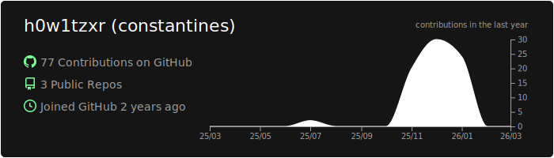
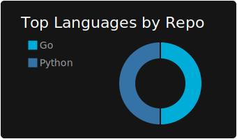
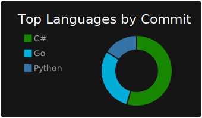
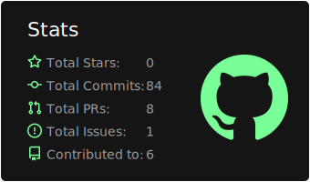
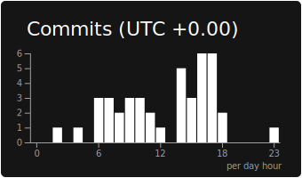

<!-- ═══════════════════════════════════════════════════════════════════════════
     Constantines | Offensive Security | CTF | Learning
     ═══════════════════════════════════════════════════════════════════════════ -->

<!-- Animated Header -->

 

<!-- Profile GIF -->

  

 

  

<!-- Status Pills -->

&nbsp;

&nbsp;

  

<!-- Typing Effect -->

 

<!-- ═══════════════════════════════════════════════════════════════════════════ -->

## Metrics

 

<!-- GitHub Stats Card -->

 

 

  

<!-- Streak Stats -->
<a href="https://github.com/h0w1tzxr">
  <picture>
    <source media="(prefers-color-scheme: dark)" srcset="https://streak-stats.demolab.com?user=h0w1tzxr&hide_border=true&background=0d1117&ring=39D353&fire=39D353&currStreakLabel=39D353&sideLabels=8b949e&dates=6e7681&currStreakNum=c9d1d9&sideNums=c9d1d9" />
    
  </picture>
</a>

  

<!-- Pacman Contribution Graph -->

 
