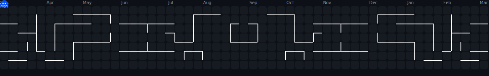
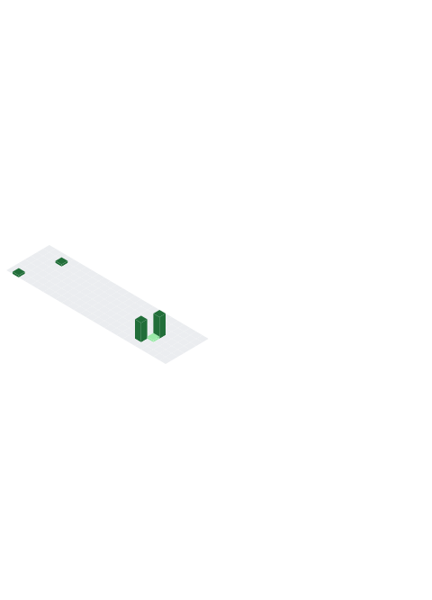

<!-- h0w1tzxr | HTB-inspired | dark/green | gamified -->

  

<!-- Intro GIF -->

  

  

  
  

  

  

---

## 🎮 Operator Console
**Class:** CTF Player (Rev / Pwn / OSINT)  
**Build:** Vulnerability research + security tooling  
**Level:** Beginner 

---

  

---

  

---
